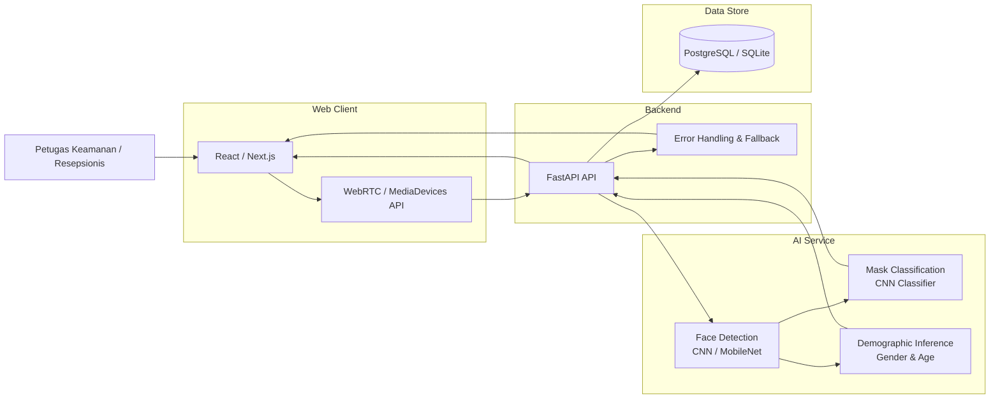
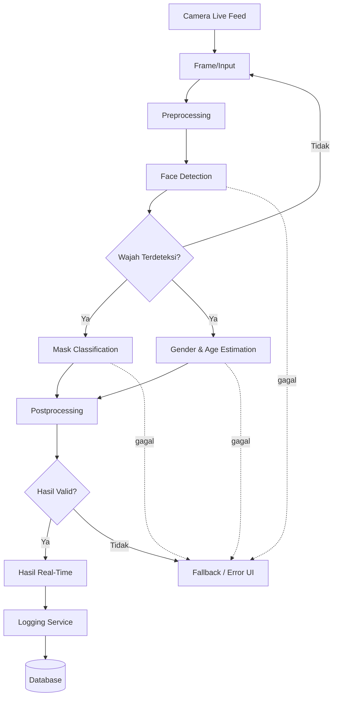
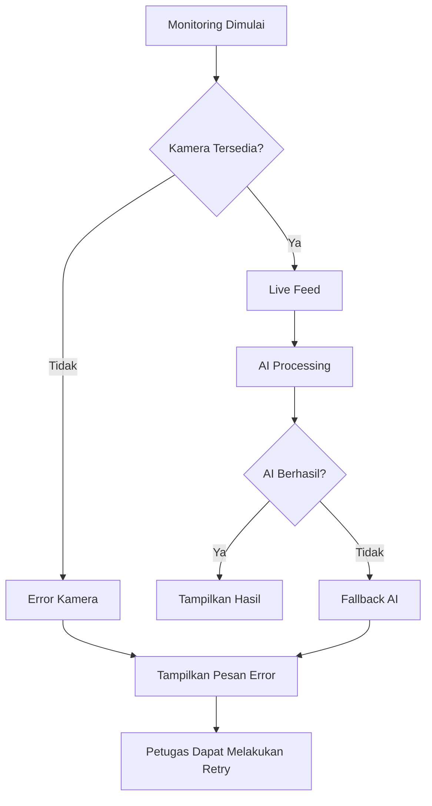

# DRAF HLD (HIGH-LEVEL DESIGN)

## Sistem Pemantau Kepatuhan Masker Berbasis AI

### 1. Tujuan dan Ruang Lingkup HLD

HLD ini mendefinisikan rancangan arsitektur tingkat tinggi untuk sistem **Sistem Pemantau Kepatuhan Masker Berbasis AI** berbasis website.

Sistem dirancang untuk mendukung:

* deteksi wajah dari live feed kamera;
* klasifikasi status penggunaan masker;
* prediksi jenis kelamin;
* estimasi rentang usia;
* penayangan hasil secara real-time;
* pencatatan hasil deteksi;
* penyajian ringkasan data agregat;
* penanganan kegagalan akses kamera.

HLD tidak membahas detail class, method, query database, atau implementasi kode karena aspek tersebut termasuk LLD. Scope ini mengikuti FR/NFR pada SRS.

---

# 2. Gambaran Arsitektur Sistem

Arsitektur menggunakan pendekatan **client–backend–AI service–data store**.



Arsitektur tersebut mempertahankan pemisahan antara antarmuka website, backend API, layanan AI, dan penyimpanan data. Komponen AI utama menggunakan OpenCV serta model CNN berbasis MobileNet sebagaimana menjadi dependensi pada SRS.

---

# 3. Deskripsi Komponen

| Komponen                          | Peran                | Tanggung Jawab                                                                          | Teknologi Usulan            |
| --------------------------------- | -------------------- | --------------------------------------------------------------------------------------- | --------------------------- |
| **Web Client**                    | Antarmuka pengguna   | Menampilkan live feed, hasil deteksi, status sistem, dan informasi agregat              | React / Next.js             |
| **Camera Interface**              | Sumber input visual  | Mengakses kamera perangkat dan menyediakan live stream                                  | WebRTC / MediaDevices API   |
| **Backend API**                   | Penghubung sistem    | Menerima input/proses dari client, mengoordinasikan AI, logging, dan response ke client | Python FastAPI              |
| **Face Detection Service**        | Deteksi wajah        | Menemukan lokasi wajah dari frame kamera                                                | OpenCV + CNN/MobileNet      |
| **Mask Classification Service**   | Klasifikasi masker   | Mengklasifikasikan status masker pada wajah terdeteksi                                  | CNN Classifier              |
| **Demographic Inference Service** | Data demografis      | Menghasilkan klasifikasi jenis kelamin dan estimasi rentang usia                        | Model AI Computer Vision    |
| **Logging Service**               | Pencatatan           | Menyimpan timestamp, status masker, dan data demografis                                 | FastAPI + PostgreSQL/SQLite |
| **Error Handling & Fallback**     | Penanganan kegagalan | Menangani kamera gagal, stream terputus, dan kegagalan proses AI                        | FastAPI + React/Next.js     |
| **Database**                      | Penyimpanan data     | Menyimpan hasil klasifikasi/log yang diperlukan sistem                                  | PostgreSQL / SQLite         |

Komponen tersebut diturunkan dari kebutuhan deteksi, klasifikasi, logging, agregasi, dan error handling pada SRS.

---

# 4. Keputusan Arsitektur AI

Untuk prototype satu semester dengan biaya minimal, terdapat dua alternatif utama.

| Aspek                  | AI On-Device / Client                                         | AI Service / Backend                              |
| ---------------------- | ------------------------------------------------------------- | ------------------------------------------------- |
| Akurasi                | Bergantung kemampuan perangkat                                | Model terpusat sehingga lebih mudah dikontrol     |
| Latensi                | Berpotensi rendah karena tidak perlu mengirim frame ke server | Dipengaruhi komunikasi client–server              |
| Biaya                  | Infrastruktur server AI lebih kecil                           | Membutuhkan resource server untuk inference       |
| Privasi                | Frame dapat diproses lokal                                    | Frame dapat melewati backend                      |
| Effort                 | Implementasi browser/model lebih kompleks                     | Integrasi Python/OpenCV lebih sesuai dengan stack |
| Pengembangan prototype | Lebih kompleks untuk model CNN                                | Lebih mudah menggunakan ekosistem Python          |
| Konsistensi model      | Bergantung perangkat/browser                                  | Model terpusat                                    |

### Keputusan HLD

**Rekomendasi: AI Service berbasis Python/OpenCV pada backend.**

Alasannya, stack yang diberikan memang menetapkan Python FastAPI sebagai backend dan OpenCV + TensorFlow/MobileNet sebagai AI service. Selain itu, penggunaan model terpusat memudahkan pengujian terhadap target akurasi dan latency.

Namun, karena target latency adalah **<1 detik per wajah**, komunikasi client–backend harus diuji secara end-to-end, bukan hanya mengukur waktu inference model.

**[ASUMSI-01]** Infrastruktur deployment yang dipilih mampu menjalankan inference model dalam batas latency yang dipersyaratkan.

---

# 5. Aliran Data End-to-End

## 5.1 Alur Utama



## 5.2 Tahapan Pemrosesan

### 1. Input

Kamera perangkat menyediakan live feed melalui **WebRTC / MediaDevices API**.

Input utama:

```text
Live Camera Frame
        ↓
Frame gambar/video
```

### 2. Preprocessing

Frame dipersiapkan sebelum diberikan kepada model AI.

**[ASUMSI-02]** Tahapan preprocessing spesifik seperti resize, normalisasi, atau format warna mengikuti kebutuhan model yang digunakan dan belum ditentukan dalam SRS.

### 3. Face Detection

Face Detection Service memproses frame menggunakan model Vision/CNN berbasis MobileNet.

Output:

```text
Face detected
→ koordinat/lokasi wajah
```

Kebutuhan ini berasal dari FR-01.

### 4. Mask Classification

Area wajah yang terdeteksi diberikan kepada Mask Classification Model.

Output:

```text
Pakai Masker
atau
Tidak Pakai Masker
```

Target akurasi sistem:

```text
≥ 95%
```

sesuai NFR-01.

### 5. Demographic Inference

Wajah terdeteksi juga dapat diproses oleh Demographic Inference Engine untuk menghasilkan:

```text
Jenis Kelamin
Rentang Usia
```

Hasil ini merupakan **klasifikasi/estimasi**, bukan identitas individu.

### 6. Postprocessing

Backend menggabungkan hasil AI menjadi response yang dapat ditampilkan pada frontend.

Contoh struktur konseptual:

```json
{
  "timestamp": "...",
  "mask_status": "Pakai Masker",
  "gender": "...",
  "age_range": "..."
}
```

**[ASUMSI-03]** Nama field API final dapat disesuaikan saat LLD/API specification dibuat.

### 7. Output

Frontend menampilkan hasil kepada petugas secara real-time.

Output utama:

```text
Wajah terdeteksi
Status masker
Jenis kelamin
Rentang usia
```

### 8. Penyimpanan

Hasil klasifikasi yang diperlukan dicatat melalui Logging Service ke database.

Data minimum:

```text
timestamp
status masker
jenis kelamin
rentang usia
```

Gambar wajah mentah **tidak disimpan secara permanen**.

---

# 6. Fallback dan Error Handling

Fallback diperlukan karena sistem bergantung pada kamera dan beberapa proses AI.



### Kondisi yang ditangani

| Kondisi                     | Respons Sistem                                             |
| --------------------------- | ---------------------------------------------------------- |
| Kamera tidak ditemukan      | Menampilkan pesan kesalahan                                |
| Permission kamera ditolak   | Menampilkan informasi akses kamera                         |
| Kamera terputus             | Menghentikan proses deteksi baru dan menampilkan error     |
| Face detection gagal        | Tidak menghasilkan klasifikasi wajah                       |
| Mask classification gagal   | Menampilkan kondisi error/fallback                         |
| Demographic inference gagal | Data demografis tidak dipaksakan untuk diisi               |
| Backend/AI timeout          | Sistem memberikan fallback tanpa menyebabkan browser crash |

Target NFR-04 adalah **100% kasus pengujian kegagalan kamera ditangani tanpa crash**.

---

# 7. Kontrak Antarkomponen Tingkat Tinggi

## 7.1 Client → Backend

Endpoint konseptual:

```text
POST /api/detection
```

Tujuan:

* mengirim input/proses deteksi;
* meminta pemrosesan AI;
* memperoleh hasil klasifikasi.

**[ASUMSI-04]** Nama endpoint dan mekanisme pengiriman frame belum ditentukan oleh SRS dan harus ditetapkan pada tahap API/LLD.

---

## 7.2 Backend → AI Service

Alur konseptual:

```text
Backend
   ↓
Face Detection
   ↓
Mask Classification
   ↓
Demographic Inference
   ↓
Combined Result
```

Data antar-komponen berupa frame/region wajah dan hasil inference.

---

## 7.3 Backend → Database

Setelah hasil klasifikasi diperoleh:

```text
AI Result
   ↓
Logging Service
   ↓
Database
```

Data yang disimpan:

```text
timestamp
status_masker
jenis_kelamin
rentang_usia
```

Tidak menyimpan raw face image secara permanen.

---

# 8. Event Utama Sistem

| Event                        | Trigger                           | Proses                           | Output               |
| ---------------------------- | --------------------------------- | -------------------------------- | -------------------- |
| **Camera Started**           | User mengaktifkan monitoring      | Browser meminta akses kamera     | Live feed            |
| **Frame Received**           | Frame kamera tersedia             | Frame diteruskan ke proses AI    | Input AI             |
| **Face Detected**            | Model menemukan wajah             | Mask & demographic inference     | Hasil AI             |
| **Classification Completed** | Model selesai melakukan inference | Backend melakukan postprocessing | Detection result     |
| **Detection Logged**         | Hasil klasifikasi tersedia        | Logging Service menyimpan hasil  | Record database      |
| **Camera Failed**            | Kamera tidak tersedia/terputus    | Error handler aktif              | Error UI             |
| **AI Processing Failed**     | Model gagal/timeout               | Fallback aktif                   | Error/fallback state |

---

# 9. Target Performance

Target performa mengikuti NFR yang telah ditentukan.

| Parameter                         |             Target |
| --------------------------------- | -----------------: |
| Akurasi klasifikasi masker        |           **≥95%** |
| Latensi deteksi/prediksi          | **<1 detik/wajah** |
| Pemahaman penggunaan dasar        |       **≤5 menit** |
| Penanganan kegagalan kamera       |     **100% kasus** |
| Raw face image tersimpan permanen |              **0** |

Target tersebut berasal dari KPI/NFR pada PRD dan SRS.

---

# 10. Security & Privacy by Design

## 10.1 Authentication

SRS belum menetapkan mekanisme autentikasi.

**[ASUMSI-05]** Mekanisme authentication dan authorization akan ditentukan pada tahap desain keamanan/LLD jika diperlukan oleh deployment aktual.

Untuk prototype, akses dapat dibatasi pada pengguna sistem yang berwenang sesuai kebutuhan deployment.

## 10.2 Data Sensitif

Data yang perlu diperhatikan:

* hasil jenis kelamin;
* estimasi rentang usia;
* status masker;
* timestamp;
* input visual kamera selama proses berlangsung.

Jenis kelamin dan usia diperlakukan sebagai **hasil klasifikasi/estimasi**, bukan identitas individu.

## 10.3 Penyimpanan Gambar

Sistem tidak menyimpan gambar wajah mentah secara permanen.

```text
Camera Frame
     ↓
AI Processing
     ↓
Classification Result
     ↓
Log Database

Raw Face Image
     ↓
Tidak disimpan permanen
```

Hal ini merupakan kebutuhan eksplisit NFR-05 dan non-goal produk.

## 10.4 Enkripsi

**[ASUMSI-06]** Untuk deployment aktual, komunikasi antara browser dan backend menggunakan HTTPS/TLS. Detail sertifikat dan konfigurasi keamanan berada di luar HLD dan ditentukan pada deployment configuration.

---

# 11. Logging dan Data Store

### Konsep penyimpanan

```text
┌─────────────────────────────┐
│ Detection Log               │
├─────────────────────────────┤
│ timestamp                   │
│ status_masker               │
│ jenis_kelamin               │
│ rentang_usia                │
└─────────────────────────────┘
```

Database dapat menggunakan:

### PostgreSQL

Digunakan ketika prototype membutuhkan database server terpisah dan akses multi-user.

### SQLite

Digunakan untuk prototype sederhana dengan kebutuhan deployment minimal.

**Rekomendasi HLD: PostgreSQL** apabila backend deployment menggunakan server/cloud karena lebih sesuai untuk layanan backend yang berjalan secara terpisah.

**Alternatif:** SQLite untuk pengembangan lokal dan demonstrasi sederhana.

---

# 12. Deployment Environment

## 12.1 Development

```text
Developer PC
├── React / Next.js
├── Python FastAPI
├── OpenCV
├── TensorFlow / MobileNet
└── PostgreSQL / SQLite
```

Digunakan untuk:

* pengembangan;
* debugging;
* pengujian model;
* pengujian integrasi.

## 12.2 Staging

**[ASUMSI-07]**

Lingkungan staging digunakan untuk menguji integrasi frontend, backend, AI service, dan database sebelum demonstrasi/deployment.

```text
Frontend
    ↓
Backend
    ↓
AI Service
    ↓
Database
```

## 12.3 Production / Demo

Stack deployment yang disarankan:

```text
User Browser
      ↓
Vercel
Frontend
      ↓
Render / Railway
FastAPI + AI Service
      ↓
PostgreSQL
```

**Catatan:** kemampuan free-tier untuk menjalankan inference AI dan memenuhi target latency <1 detik belum dibuktikan dalam dokumen sumber. Oleh karena itu, performa deployment harus divalidasi melalui pengujian aktual dan tidak dianggap otomatis memenuhi NFR-02.

---

# 13. Pemetaan Komponen terhadap Functional Requirement

| FR    | Kebutuhan              | Komponen Utama                            |
| ----- | ---------------------- | ----------------------------------------- |
| FR-01 | Deteksi wajah          | Camera Interface + Face Detection Service |
| FR-02 | Klasifikasi masker     | Face Detection + Mask Classification      |
| FR-03 | Prediksi jenis kelamin | Demographic Inference — Gender            |
| FR-04 | Estimasi usia          | Demographic Inference — Age               |
| FR-05 | Hasil real-time        | Web Client + Backend API + AI Service     |
| FR-06 | Logging                | Backend API + Logging Service + Database  |
| FR-07 | Ringkasan agregat      | Database + Backend API + Dashboard        |
| FR-08 | Error kamera           | Camera Interface + Error/Fallback Module  |
| FR-09 | Filter periode         | **[OUT OF SCOPE / Could Have]**           |
| FR-10 | Visualisasi statistik  | **[OUT OF SCOPE / Could Have]**           |

FR-09 dan FR-10 berstatus **Could Have** dan tidak dibuat menjadi User Story pada backlog saat ini.

---

# 14. Pemetaan Komponen terhadap Non-Functional Requirement

| NFR    |                           Target | Komponen yang Bertanggung Jawab  |
| ------ | -------------------------------: | -------------------------------- |
| NFR-01 |                    Accuracy ≥95% | Mask Classification Model        |
| NFR-02 |                   <1 detik/wajah | Frontend + Backend + AI Service  |
| NFR-03 |                         ≤5 menit | Web Client / Dashboard           |
| NFR-04 |       100% kasus error ditangani | Error Handling + Fallback UI     |
| NFR-05 |             0 raw image permanen | Backend + Database + Data Policy |
| NFR-06 | 100% jenis data sesuai ketentuan | Logging Service + Database       |

---

# 15. Risiko Arsitektur

| Risiko                                      | Dampak                            | Mitigasi                                                                |
| ------------------------------------------- | --------------------------------- | ----------------------------------------------------------------------- |
| Latensi komunikasi client–backend tinggi    | Target <1 detik tidak tercapai    | Uji latency end-to-end dan optimalkan ukuran/input frame                |
| Model AI membutuhkan resource besar         | Inference lambat pada free-tier   | Gunakan model yang sesuai kemampuan prototype dan ukur performanya      |
| Kamera memiliki kualitas rendah             | Deteksi wajah dapat menurun       | Uji pada kondisi kamera yang relevan                                    |
| Kamera terputus                             | Monitoring berhenti               | Error handling dan fallback UI                                          |
| Demographic inference gagal                 | Data agregat tidak lengkap        | Izinkan nilai demografis tidak tersedia                                 |
| Penyimpanan raw image tidak sengaja terjadi | Risiko privasi                    | Audit database/filesystem dan pastikan hanya hasil klasifikasi disimpan |
| Free-tier tidak memenuhi kebutuhan AI       | Deployment tidak memenuhi latency | Lakukan benchmark sebelum deployment final                              |

Risiko tersebut konsisten dengan risiko yang telah dicantumkan dalam PRD, terutama kondisi kamera, perbedaan performa prototype dengan penelitian, privasi, dan keterbatasan biaya AI.

---

# 16. Ringkasan Arsitektur Akhir

```text
                    ┌──────────────────────┐
                    │       USER           │
                    │ Security / Reception │
                    └──────────┬───────────┘
                               │
                               ▼
                    ┌──────────────────────┐
                    │    WEB FRONTEND      │
                    │ React / Next.js      │
                    │ Dashboard + Camera   │
                    └──────────┬───────────┘
                               │
                     WebRTC / API
                               │
                               ▼
                    ┌──────────────────────┐
                    │     FASTAPI           │
                    │   Backend API         │
                    └──────┬───────┬───────┘
                           │       │
              ┌────────────┘       └─────────────┐
              ▼                                  ▼
    ┌──────────────────────┐          ┌────────────────────┐
    │    AI SERVICE        │          │  LOGGING SERVICE   │
    │                      │          │                    │
    │ Face Detection       │          │ Timestamp          │
    │ Mask Classification  │          │ Mask Status        │
    │ Gender Estimation    │          │ Gender             │
    │ Age Estimation       │          │ Age Range          │
    └──────────┬───────────┘          └─────────┬──────────┘
               │                                │
               └──────────────┐       ┌─────────┘
                              ▼       ▼
                         ┌─────────────────┐
                         │    DATABASE     │
                         │ PostgreSQL/     │
                         │ SQLite          │
                         └─────────────────┘
```

## Prinsip Arsitektur Utama

1. **AI menjadi komponen inti**, karena FR-01 sampai FR-04 bergantung pada Computer Vision.
2. **Frontend bertanggung jawab terhadap interaksi dan visualisasi**, bukan logika model AI.
3. **FastAPI menjadi penghubung** antara frontend, AI service, dan database.
4. **Database hanya menyimpan hasil klasifikasi yang diperlukan**, bukan gambar wajah mentah.
5. **Error handling menjadi bagian arsitektur**, bukan hanya fitur UI, karena NFR-04 mensyaratkan sistem tetap stabil ketika kamera gagal.
6. **FR-09 dan FR-10 tidak menjadi bagian implementasi inti prototype**, karena keduanya berstatus Could Have dan belum memiliki User Story turunan.
7. **Target performa harus dibuktikan melalui pengujian aktual**; angka performa penelitian MobileNet yang disebut dalam PRD merupakan bukti referensi dan bukan jaminan performa prototype.
