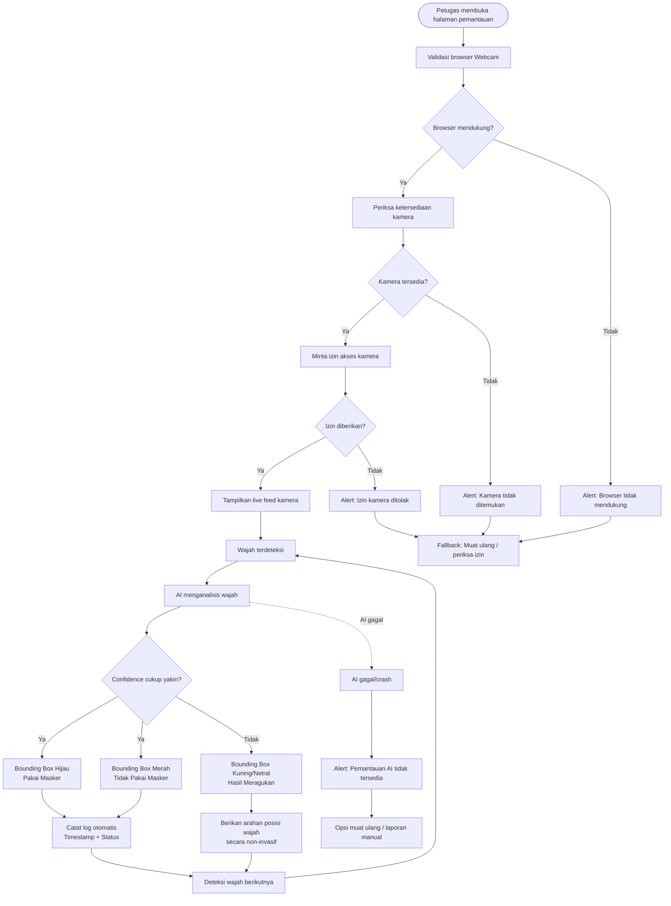

# DRAFT User Flow

## UC-01 — Pemantauan Kepatuhan Masker Secara Real-Time

**Aktor utama:** Petugas keamanan / resepsionis
**Tujuan:** Memantau status masker pengunjung secara otomatis melalui kamera, menampilkan hasil secara real-time, dan mencatat hasil deteksi sebagai log.

> **Prinsip UX:** Petugas cukup melakukan aktivasi kamera sekali. Setelah pemantauan berjalan, sistem bekerja otomatis sehingga interaksi petugas seminimal mungkin.

---

# 1) Langkah Alur Pengguna — User Step-by-Step

### A. Entry Point & Validasi Perangkat

**1. Petugas membuka halaman pemantauan**

→ Sistem menampilkan halaman pemantauan dan memulai pemeriksaan kesiapan perangkat.

**2. Sistem memvalidasi perangkat**

Sistem memeriksa:

* Dukungan browser terhadap penggunaan Webcam.
* Ketersediaan perangkat kamera.
* Status izin akses kamera.

→ Jika seluruh pemeriksaan valid, pengguna dapat melanjutkan.

→ Jika terdapat masalah, sistem masuk ke **Fallback Flow**.

---

### B. Aktivasi Kamera

**3. Sistem meminta izin kamera**

→ Petugas memberikan izin akses kamera pada browser.

**4. Kamera berhasil diaktifkan**

→ Sistem menampilkan **live feed** kamera.

→ Petugas tidak perlu melakukan input tambahan untuk setiap pengunjung.

---

### C. Pemrosesan AI Real-Time

**5. Pengunjung masuk ke area kamera**

→ Sistem menangkap live feed dan mendeteksi wajah.

**6. Sistem menganalisis wajah**

→ AI melakukan klasifikasi status masker.

Hasil yang mungkin:

* **Confidence tinggi** → hasil dianggap cukup yakin.
* **Confidence rendah** → hasil dianggap meragukan.

**7. Sistem memberikan feedback proses**

Selama AI melakukan analisis, interface memberikan indikator bahwa wajah sedang diproses.

Target pemrosesan dan penayangan hasil: **<1 detik per wajah**.

---

### D. Penanganan Hasil

**8A. Confidence tinggi**

Jika hasil AI cukup yakin:

* **Hijau** → **Pakai Masker**
* **Merah** → **Tidak Pakai Masker**

→ Hasil ditampilkan pada live feed.

→ Sistem mencatat log otomatis berupa **timestamp + status masker**.

→ Sistem kembali memantau wajah berikutnya.

---

**8B. Confidence rendah / hasil meragukan**

Jika AI tidak cukup yakin:

* Bounding box ditampilkan **kuning/netral**.
* Sistem tidak memberikan keputusan pasti "Pakai" atau "Tidak Pakai".
* Sistem dapat memberikan arahan ringan seperti **"Posisikan wajah lebih jelas"**.
* Tidak ada keputusan kepatuhan pasti yang dibuat dari hasil tersebut.

→ Setelah kondisi wajah membaik, sistem dapat melakukan analisis kembali.

---

### E. Pemantauan Berkelanjutan

**9. Sistem kembali ke live monitoring**

→ Wajah berikutnya diproses secara otomatis.

→ Petugas hanya perlu memperhatikan hasil yang ditampilkan dan mengambil tindakan sesuai prosedur operasional gedung.

---

# 2) Detail 4 Status Sistem

## State 1 — Validasi Awal Perangkat

**Tujuan:** Memastikan perangkat siap sebelum live feed digunakan.

| Pemeriksaan              | Respons Sistem                                            |
| ------------------------ | --------------------------------------------------------- |
| Browser mendukung Webcam | Lanjut ke pemeriksaan kamera                              |
| Browser tidak mendukung  | Tampilkan peringatan bahwa browser tidak mendukung kamera |
| Kamera tersedia          | Lanjut meminta izin                                       |
| Kamera tidak ditemukan   | Tampilkan pesan kamera tidak ditemukan                    |
| Izin kamera diberikan    | Aktifkan live feed                                        |
| Izin kamera ditolak      | Masuk ke fallback                                         |

### Prinsip UX

Pesan harus **singkat dan langsung menunjukkan tindakan**, misalnya:

> **"Kamera tidak dapat digunakan. Periksa izin kamera browser, kemudian coba lagi."**

---

## State 2 — AI Sedang Menganalisis

Ketika wajah terdeteksi, sistem memberikan feedback visual pada live stream.

**Alur visual:**

`Wajah terdeteksi → Processing indicator → Hasil klasifikasi`

Target:

**Hasil deteksi tampil <1 detik per wajah.**

Selama proses berlangsung, sistem tidak boleh memberikan status masker yang belum tersedia sebagai keputusan final.

Contoh indikator:

> **Menganalisis...**

Setelah hasil tersedia, indikator proses digantikan oleh hasil klasifikasi.

---

## State 3 — Hasil Yakin vs. Meragukan

### A. Confidence Tinggi

Jika confidence memenuhi ambang yang ditetapkan untuk hasil yang dianggap yakin:

| Status             | Visual                 | Tindakan                    |
| ------------------ | ---------------------- | --------------------------- |
| Pakai Masker       | Bounding box **Hijau** | Tampilkan hasil + catat log |
| Tidak Pakai Masker | Bounding box **Merah** | Tampilkan hasil + catat log |

**Catatan penting:** SRS menetapkan target **akurasi ≥95%**, tetapi **tidak menetapkan angka confidence threshold**. Oleh karena itu, nilai seperti `confidence ≥95%` **tidak boleh dianggap sebagai requirement SRS**. Threshold confidence harus ditentukan dan divalidasi pada tahap pengembangan/pengujian.

### B. Confidence Rendah / Meragukan

Jika hasil AI belum cukup yakin:

* Bounding box **Kuning/Netral**.
* Jangan menampilkan keputusan pasti.
* Jangan mencatat hasil sebagai "Pakai" atau "Tidak Pakai" berdasarkan prediksi yang meragukan.
* Berikan arahan non-invasif, misalnya:

  > **"Wajah kurang jelas. Silakan posisikan wajah lebih terlihat."**

Tujuannya adalah mencegah sistem memberikan keputusan yang terlihat pasti ketika AI sebenarnya tidak yakin.

---

## State 4 — Fallback Mechanism

Fallback digunakan ketika sistem tidak dapat menjalankan pemantauan normal.

### Skenario A — Kamera Tidak Ditemukan

**Respons:**

`Kamera tidak ditemukan → Alert → Opsi Muat Ulang / Periksa Perangkat`

Sistem tetap berjalan tanpa crash.

### Skenario B — Izin Kamera Ditolak

**Respons:**

`Izin ditolak → Alert → Petunjuk mengaktifkan izin → Coba Lagi`

Petugas diberi kesempatan mencoba kembali setelah izin diperbaiki.

### Skenario C — AI Gagal/Crash

**Respons:**

`AI gagal → Hentikan hasil klasifikasi → Tampilkan alert → Coba Muat Ulang`

Sistem tidak boleh menampilkan hasil klasifikasi yang tidak valid sebagai hasil final.

### Skenario D — Kamera/AI Tidak Dapat Dipulihkan

Sebagai fallback operasional:

> **"Pemantauan otomatis tidak tersedia. Silakan gunakan prosedur pelaporan manual."**

Dengan demikian, kegagalan AI tidak membuat proses operasional petugas terhenti sepenuhnya.

---

# 3) Diagram Alur — Mermaid

---

# 4) Traceability Matrix

| Langkah / Status | Deskripsi                                       | Use Case | Acceptance Criteria           |
| ---------------- | ----------------------------------------------- | -------- | ----------------------------- |
| **UF-01**        | Petugas membuka halaman pemantauan              | UC-01    | Skenario sukses               |
| **UF-02**        | Validasi dukungan browser dan kamera            | UC-01    | Skenario kamera gagal         |
| **UF-03**        | Petugas memberikan izin kamera                  | UC-01    | Skenario sukses               |
| **UF-04**        | Live feed kamera aktif                          | UC-01    | Skenario sukses               |
| **UF-05**        | Sistem mendeteksi wajah                         | UC-01    | Skenario sukses               |
| **UF-06**        | AI mengklasifikasikan status masker             | UC-01    | Skenario sukses               |
| **UF-07**        | Hasil ditampilkan real-time                     | UC-01    | Skenario sukses               |
| **UF-08**        | Hasil yakin ditampilkan dengan indikator status | UC-01    | Skenario sukses               |
| **UF-09**        | Hasil meragukan diberi indikator netral         | UC-01    | Skenario sukses/fallback AI   |
| **UF-10**        | Hasil yakin dicatat otomatis                    | UC-01    | Skenario sukses               |
| **UF-11**        | Proses berulang untuk wajah berikutnya          | UC-01    | Skenario sukses               |
| **UF-12**        | Kamera gagal → pesan error                      | UC-01    | **Skenario 2 — Kamera Gagal** |
| **UF-13**        | Sistem tidak crash saat kamera gagal            | UC-01    | **Skenario 2 — Kamera Gagal** |
| **UF-14**        | AI gagal → alert dan fallback                   | UC-01    | Skenario fallback             |
| **UF-15**        | Gambar wajah mentah tidak disimpan permanen     | UC-01    | Skenario sukses               |

### Keterkaitan dengan Acceptance Criteria Utama

| Acceptance Criteria                                         | User Flow yang Mendukung |
| ----------------------------------------------------------- | ------------------------ |
| Deteksi wajah berhasil ketika wajah tersedia                | UF-04, UF-05             |
| Status masker menghasilkan "Pakai" / "Tidak Pakai"          | UF-06, UF-08             |
| Hasil tampil **<1 detik/wajah**                             | UF-06, UF-07             |
| Log dicatat otomatis                                        | UF-10                    |
| Log minimal timestamp + status masker                       | UF-10                    |
| Gambar wajah mentah tidak disimpan permanen                 | UF-15                    |
| Kamera gagal menghasilkan pesan jelas                       | UF-12                    |
| Sistem tidak crash saat kamera gagal                        | UF-13                    |
| Hasil AI meragukan tidak dipaksakan menjadi keputusan pasti | UF-09                    |
| Kegagalan AI memiliki jalur fallback                        | UF-14                    |

**Catatan UX penting:** angka **<1 detik/wajah** merupakan requirement yang sudah ada di NFR. Sebaliknya, **confidence threshold numerik belum ditentukan dalam SRS**, sehingga user flow sengaja menggunakan istilah *confidence cukup yakin* dan tidak mengarang angka threshold. Ini membuat desain UX tetap konsisten dengan SRS dan tidak menambahkan requirement baru.
